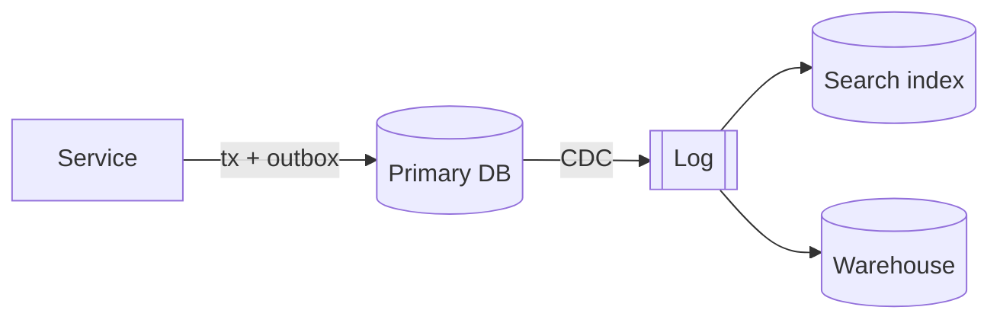

# Lens rules for brainstorming

<!-- steps-brainstorming:start — identical in software-design, clean-python and data-intensive; check with scripts/check-coordination.sh in the lens repo -->
Read one copy, from any lens, when this superpowers step starts. It holds the shared rules for the step, then one section per lens: skip the sections of lenses that aren't installed. `references/coordination.md` has the rules for every step.


## Shared

**Questions**
- Lens questions join brainstorming's queue: one per message, **at most 6 across all lenses**. Ask only when the answer changes the design; anything else becomes an assumption in the write-back. Skip whatever the context already answers.
- **Choice** (approach, guarantee to pay for, path): put the recommended option first, with its reason.
- **Fact** about the user's world (load, traffic shape, domain rules, team, existing systems, what prompted the request): give ranges plus "Not sure — assume <smallest reasonable>". Never mark an option "recommended" or "default".
- Record every input under one of four labels:
  - **Stated:** the user said it.
  - **Decided:** an approved recommendation on a choice.
  - **Assumed (default accepted):** only for questions actually asked.
  - **Assumed (inferred, not asked).**

  If a conclusion rests on an assumption, say so.
- Order, with duplicates merged:
  1. workload and loss tolerance (data);
  2. guarantees, including the delivery semantics of any side effect the feature relies on (data);
  3. change directions and growth horizon, as one question (design + data);
  4. source of truth (data);
  5. what callers must never need to know (design);
  6. concurrency model, as one question (python + data);
  7. extension points, value objects, typing (python), usually as assumptions.

**Approaches.** The 2–3 approaches differ on the dominant risk:
- data-intensive sets the axis when guarantees, scale or multiple stores dominate;
- otherwise software-design sets it;
- clean-python never sets it; with only clean-python installed, brainstorming's own comparison stands.

Each other active lens adds one line per approach (`design: … · python: …`).

**Spec.** The spec's top-level headings are brainstorming's five design sections plus one closing **Implementation notes** heading. Lens content goes in as `###` subsections under those headings, never as new top-level headings or a second document. The templates at the end of this file use this layout. Skip any subsection that would only say "n/a". Lenses add no approval rounds: each design section is presented and approved once, with its lens subsections inside it.
- **Architecture:** approaches, including rejected ones; likely directions of change; knowledge to hide; load and targets; guarantees; systems of record.
- **Components:** module cards with their Python form; extension points; value objects; layering; cross-module decisions.
- **Data flow:** diagram, data model, replication and partitioning, correctness mechanisms, encoding and schema evolution.
- **Error handling:** the exception hierarchy, then ONE table: failure (for data, the event sequence) → where it's handled (defined away / masked / exposed) and how → exception type → caller-visible? → detection. Data failure-analysis rows go in this table.
- **Testing:** test levels, fakes vs the real engine, property tests.
- **Implementation notes:** runtime, tooling and checks, package layout, injection, concurrency, operations, product facts relied on.

Self-review runs every active lens's checks in one pass and fixes the spec inline. Don't add a section that records self-review results.

## software-design

### brainstorming (architectural)
- **Context:** list the modules the work touches and what each hides. Note leaked knowledge. Unrelated refactoring goes under design debt.
- **Questions** (within the shared budget):
  - Where is this likely to change? Module boundaries go around those decisions.
  - What's the common case? Make it trivial.
  - What should callers never need to know?
- **Approaches = design it twice:**
  - Decompose around knowledge, not around the order things happen (that's temporal decomposition).
  - Approaches must differ in their boundaries and in what each module hides.
  - Compare them on: how simple the interface is for the common case, how much each hides, generality at no extra cost to callers, performance, and weaknesses.
  - If no approach is attractive, generate another from their weaknesses.
- **Module card** in Components (template in the Spec subsections part below):
  - abstraction in one sentence;
  - what it hides;
  - interface: signatures, each with a one-line comment;
  - errors: defined away / masked / exposed;
  - defaults.

  If a module is hard to name or describe, fix the decomposition.
- **Self-review red flags:**
  - shallow module;
  - information leakage;
  - temporal decomposition;
  - overexposure;
  - pass-through method or variable;
  - special-general mixture;
  - conjoined modules;
  - too many exceptions;
  - configuration sprawl;
  - a name or description that is hard to write.

### brainstorming (bounded / spike)
- **Bounded:** use the SKILL.md quick rule. If the clean fix would restructure components, say so, so brainstorming can step up.
- **Spike:** don't apply the lens to throwaway code. Mention any design implication in the recommendation.


## clean-python

### brainstorming (architectural)
- **Context:** note the Python version, packaging (`pyproject`, `src/` layout), dependency manager, formatter, linter, type checker, typing level, test setup, framework conventions, and whether the code is sync or async. Follow what exists; gaps become design inputs.
- **Choices** (within the shared budget, usually as assumptions):
  - sync or async: match the codebase, and use async only for I/O-bound concurrency;
  - `Protocol` (plug-ins and test doubles) or ABC (shared implementation);
  - `@dataclass(frozen=True)` inside, with validation (e.g. pydantic) at the edges;
  - `mypy --strict` for new modules.
- **Approaches:** add one line per approach on how naturally it maps to Python. Prefer protocols, dataclasses, and generators over class frameworks. Dependencies should be injected, and the design testable without heavy patching.
- **Spec** (templates in the Spec subsections part below, placed under brainstorming's headings):
  - Components: extension points, value objects;
  - Error handling: the exception hierarchy (one package base, translated at the boundaries);
  - Testing: the approach;
  - Implementation notes: runtime and required checks, typing level, package layout and `__all__`, injection points, concurrency.
- **Self-review:** can each component be tested without its real dependencies? Is each exception defined in one place? Are frameworks kept at the edges? Is any inheritance there only for reuse?

### brainstorming (bounded / spike)
- **Bounded:** use the SKILL.md quick rule. If a function's argument list grows too long, suggest a parameter object. A new dependency goes into the package's declared dependencies.
- **Spike:** don't polish throwaway code. Report Python findings that affect the real design, e.g. "the library is sync-only".


## data-intensive

### brainstorming (architectural): the data track
- **Context:** note:
  - the stores;
  - the source of truth for each entity;
  - the actual isolation level (from config);
  - replication;
  - queues and pipelines;
  - migration tooling;
  - dual writes already present.
- **Questions:** use `references/question-bank.md` §1, within the shared budget and order. Load and domain answers are facts; guarantees are choices.
- **Approaches:** 2–3 data architectures that differ in substance:
  - where the source of truth lives;
  - how derived data is produced (sync, CDC, batch);
  - whether to partition, and by what key;
  - where correctness is enforced.

  Compare them on guarantees met, headroom against growth, failure behaviour, operational burden, and cost of change. Say plainly when one database is enough.
- **Spec** (templates in the Spec subsections part below, placed under brainstorming's headings):
  - Architecture: load and targets, guarantees → mechanisms, systems of record;
  - Data flow: the diagram, data model, replication and partitioning, correctness mechanisms, encoding and evolution;
  - Error handling: failure-analysis rows in the shared error table;
  - Testing: tests against the real engine;
  - Implementation notes: operations, product facts.
- **Self-review:**
  - one source of truth per entity;
  - every guarantee is named, along with its mechanism;
  - no dual writes (use an outbox or CDC);
  - every side effect has stated delivery semantics;
  - retried writes carry an idempotency key enforced at the store;
  - no ordering by wall clock across nodes;
  - no locks without fencing;
  - schema changes are expand → migrate → contract;
  - the failure analysis covers leader loss, partition, a consumer bug, and clock skew;
  - product facts are cited and dated.

### brainstorming (bounded / spike)
- **Bounded:** use the SKILL.md quick rule. If the fix would restructure the dataflow, say so, so brainstorming can step up.
- **Spike:** state the metric and the pass/fail threshold before running it.


## Spec subsections (templates)

Each installed lens's `###` subsections go under the spec's own headings, as the Spec rule above says. Omit any that don't apply.

### software-design


#### Architecture

##### Likely directions of change
<What will probably change. Module boundaries are drawn around these.>

##### Knowledge to hide
| Design decision / knowledge | Owning module |
|---|---|
| … | … |

##### Approaches considered
**<Approach A>:** <Decomposition in a paragraph: modules and what each hides. Strengths. Weaknesses.>
**<Approach B>:** <…>
**Chosen:** <approach or hybrid> — <why the others lost>

#### Components

##### <Module> (one card per significant module)
- **Abstraction:** <one sentence, without saying how it works>
- **Hides:** <…>
- **Interface:**
  ```
  <signature>   // <one-line interface comment>
  ```
- **Errors:** defined away: <…> · masked: <…> · exposed to callers: <…>
- **Defaults:** <…>
- **Depends on:** <…>

##### Layering
<Each layer and the distinct abstraction it provides — no pass-through layers.>

##### Cross-module decisions
<Decisions that span modules, recorded once here and referenced from code comments.>

### clean-python


#### Components

##### Extension points
| Point | Mechanism (Protocol / ABC / registry) | Why |
|---|---|---|

##### Value objects and data
<dataclasses (frozen?) inside; validation library at I/O boundaries; key types. Each module card's interface uses these Python types.>

#### Error handling

##### Exception hierarchy
- Base exception: `<Pkg>Error`
- Subclasses: <…>
- Translated at boundaries: <low-level error → domain error, with `raise … from e`>

<The shared error table's "exception type" column uses these names.>

#### Testing

##### Python testing approach
<unit tests against public interfaces; fakes injected vs mocks at boundaries; properties for Hypothesis; integration tests and how they're isolated>

#### Implementation notes

##### Runtime and tooling
- Python version: <…>
- Packaging / dependency manager: <…>
- Checks that must pass: <formatter> · <linter> · <type checker + strictness> · pytest (+ coverage threshold if any)

##### Package layout and public API
```
src/<pkg>/
  __init__.py      # public API: <names in __all__>
  <module>.py      # <what it holds>
tests/
  <mirrors src>
```

##### Dependencies and injection
<What's injected where (constructor/function params); what's created only at the composition root>

##### Concurrency
<sync / async / threads / processes — and why>

### data-intensive


#### Architecture

##### Load and targets
| Parameter | Now | Horizon | Source / assumption |
|---|---|---|---|
| Reads/s (peak) | | | |
| Writes/s (peak) | | | |
| Data size / growth | | | |
| Fan-out / hot keys | | | |
| Latency p50 / p99 | | | |
| Loss tolerance | | | |

##### Guarantees required
| Operation / data | Guarantee (named precisely) | Enforced by |
|---|---|---|

##### Systems of record and derived data
| Data | System of record | Derived copies | Produced by (sync / CDC / batch / stream) | Freshness |
|---|---|---|---|---|

#### Data flow

##### Dataflow diagram


##### Data model
<Schemas / documents / key design for the main entities; indexes and why.>

##### Replication and partitioning
<Topology; sync vs async and what an acknowledged write means; read-your-writes strategy; partition key and why; hot-key plan; secondary-index approach. Or: "single node + replicas is sufficient because …">

##### Correctness mechanisms
<For each invariant: constraint / isolation level / atomic update / idempotency key / fencing / single-partition log. Name the database's actual isolation level.>

##### Encoding and evolution
<Formats; schema registry or compatibility checks; expand → migrate → contract plan for schema changes.>

#### Error handling

Data failures are rows in the spec's ONE error table (columns from `coordination.md`). Cover at least these rows, and write each failure as an event sequence:

| Failure (event sequence) | Handled where and how | Exception type | Caller-visible? | Detection |
|---|---|---|---|---|
| Leader loss / failover: … | | | | |
| Network partition between A and B: … | | | | |
| Consumer bug writes bad data: … | | | | |
| Retry after timeout (unknown outcome): … | | | | |
| Clock skew / process pause: … | | | | |

#### Testing

##### Data-correctness tests
<Race, idempotency, migration, rerun and failure-injection tests, all run against the real engine; how the test database is provisioned.>

#### Implementation notes

##### Operations
<Monitoring (replication lag, consumer lag, partition skew, compaction), backups and restore tests, reprocessing path, runbooks.>

##### Product facts relied on
| Claim | Source | Checked on |
|---|---|---|
<!-- steps-brainstorming:end -->
