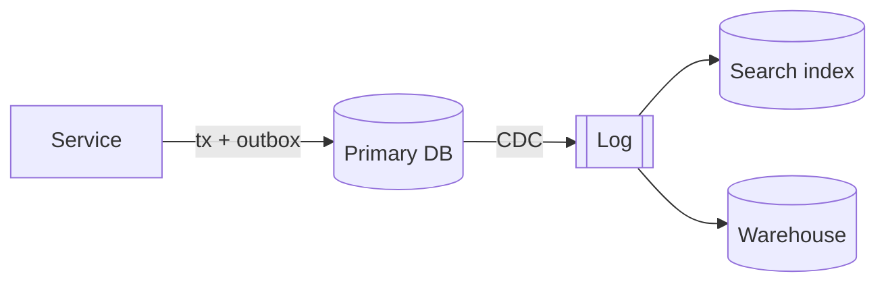

# Data sections to add to a brainstorming spec

Add these inside the superpowers spec (`docs/superpowers/specs/YYYY-MM-DD-<topic>-design.md`) under a "Data architecture" heading, alongside brainstorming's own sections and any `software-design` or `clean-python` sections. Omit sections that don't apply.

## Data architecture

### Load and targets
| Parameter | Now | Horizon | Source / assumption |
|---|---|---|---|
| Reads/s (peak) | | | |
| Writes/s (peak) | | | |
| Data size / growth | | | |
| Fan-out / hot keys | | | |
| Latency p50 / p99 | | | |
| Loss tolerance | | | |

### Guarantees required
| Operation / data | Guarantee (named precisely) | Enforced by |
|---|---|---|

### Systems of record and derived data
| Data | System of record | Derived copies | Produced by (sync / CDC / batch / stream) | Freshness |
|---|---|---|---|---|

Dataflow diagram:

### Data model
<Schemas / documents / key design for the main entities; indexes and why.>

### Replication and partitioning
<Topology; sync vs async and what an acknowledged write means; read-your-writes strategy; partition key and why; hot-key plan; secondary-index approach. Or: "single node + replicas is sufficient because …">

### Correctness mechanisms
<For each invariant: constraint / isolation level / atomic update / idempotency key / fencing / single-partition log. Name the database's actual isolation level.>

### Encoding and evolution
<Formats; schema registry or compatibility checks; expand → migrate → contract plan for schema changes.>

### Failure analysis
| Failure | Event sequence | Effect | Detection | Mitigation |
|---|---|---|---|---|
| Leader loss / failover | | | | |
| Network partition between A and B | | | | |
| Consumer bug writes bad data | | | | |
| Retry after timeout (unknown outcome) | | | | |
| Clock skew / process pause | | | | |

### Operations
<Monitoring (replication lag, consumer lag, partition skew, compaction), backups and restore tests, reprocessing path, runbooks.>

### Product facts relied on
| Claim | Source | Checked on |
|---|---|---|
