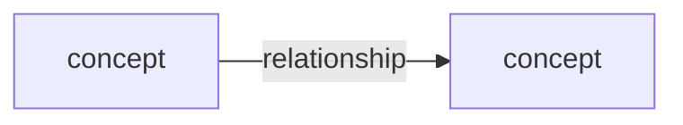

# Lesson design: <title>

> Backward design, adapted from the lesson design template in *Teaching Tech Together* (CC BY 4.0). Work the steps in order but expect to loop back. Record the final design in this order so future maintainers can follow it.

## Assumptions
<Recommendations adopted without explicit confirmation. Delete if none.>

## Step 1 — Brainstorm
Answer at least three, always including the first:
- Problems learners will be able to solve:
- Concepts and techniques:
- Tools, packages, functions:
- Terms and jargon to define:
- Analogies:
- Heuristics / rules of thumb:
- Expected mistakes and misconceptions:
- Datasets / examples:
- Deliberately out of scope:

Concept map (Mermaid or sketch):

*Deliverable: rough scope, agreed with co-designers.*

## Step 2 — Who is this for?
Personas used (see persona template): <names + one line each>
How this helps each persona:
Prerequisites beyond the personas' stated knowledge:

*Deliverable: brief summaries of who is helped and how.*

## Step 3 — What will learners do along the way?
### Summative exercise(s) (full description + solution)
1. <task, data, expected output, solution code>

### Formative exercises (1–2 per hour; point form)
- Hour 1: <exercise> — targets <misconception/objective>
- Hour 2: …

*Deliverable: 1–2 fully specified exercises with solutions, ~6 point-form outlines. Run the solutions to confirm the tools can do everything needed.*

## Step 4 — How are concepts connected?
Outline (one major bullet per hour, 3–4 episodes each, each ending in a check):
- Hour 1: <topic>
  - Episode 1.1: <content> → check: <assessment>
  - Episode 1.2: …
- Hour 2: …

Consolidated datasets/examples:

*Deliverable: course outline at hour and episode level.*

## Step 5 — Course overview (write last)
- **Description** (one-paragraph pitch to learners):
- **Learning objectives** (~6; measurable verb + criteria):
  1.
- **Prerequisites:**

## Delivery notes
- Timing plan and breaks:
- Setup instructions and check command:
- Where to ask for predictions / run peer instruction:
- What to cut if running late:
- Accessibility and inclusion notes:
